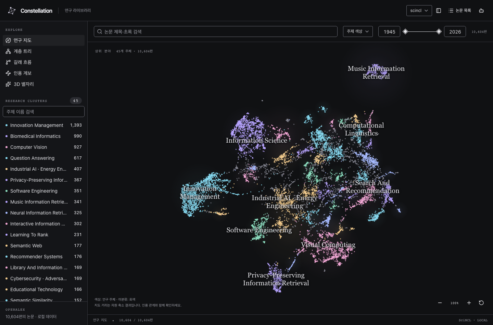
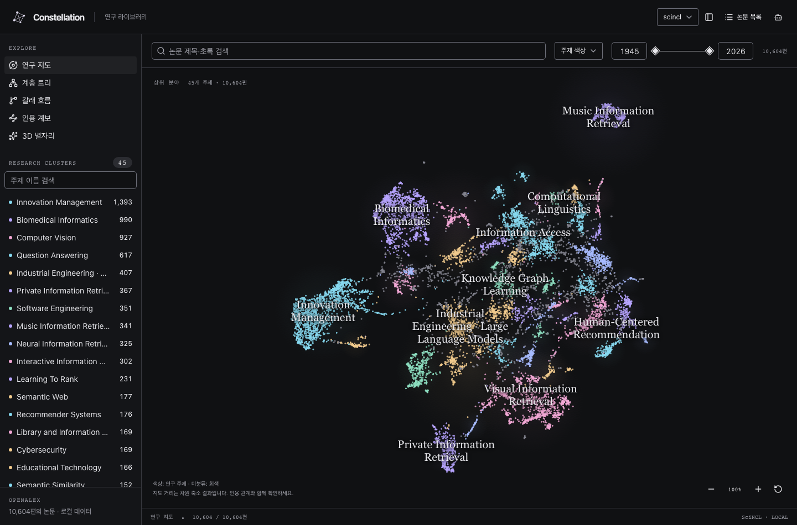
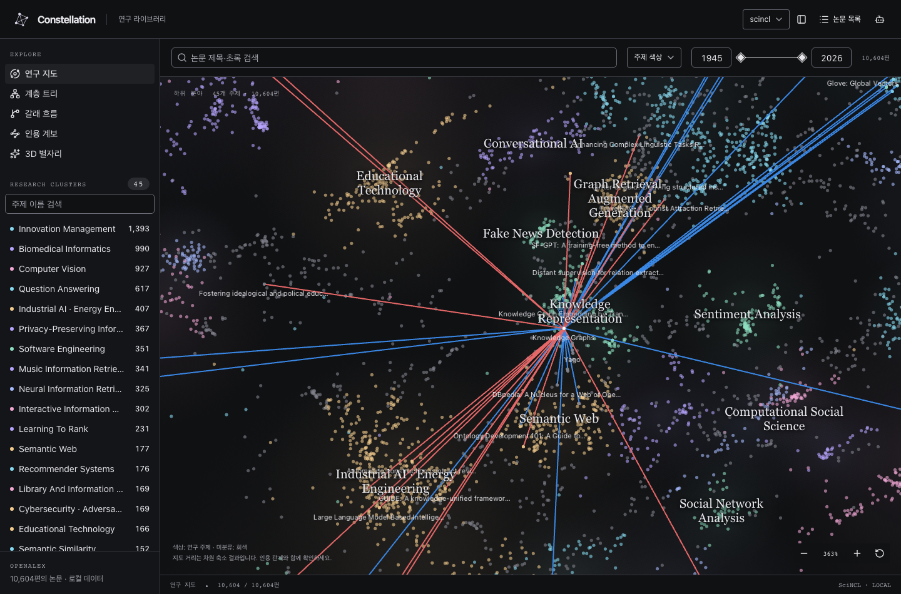
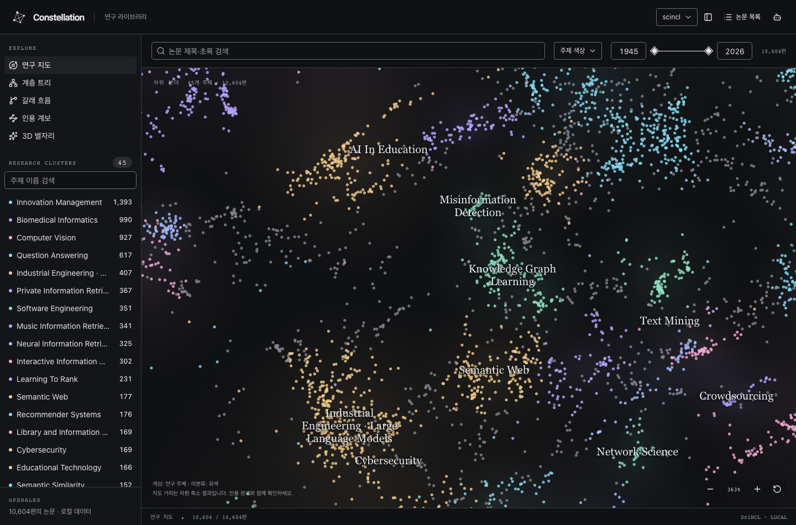

# 계층 트리 방식 비교 — 2D 좌표 Ward와 이웃 제약 주제 Ward

측정일 2026-09-19 · 코퍼스 RAG/IR 10,604편 · 임베딩 SciNCL · run `project-scincl-20260826T084511Z` · 클러스터 45개

```sh
constellation hierarchy --compare                 # 구조 지표. DB에 쓰지 않는다
constellation hierarchy --method topical          # 스크래치 사본에서
constellation name                                # codex / gpt-5.6-luna, 두 번
```

## 두 방식

| | 2d | topical |
|---|---|---|
| 병합 비용 | 클러스터 2D 중심의 Ward 거리 | 클러스터 임베딩 중심(SciNCL 평균)의 Ward 거리 |
| 병합 허용 | 제한 없음 | 2D 중심의 Delaunay 이웃(긴 변 제거, 110변) |
| 레벨 절단 | 노드 수 k=8, 18 | 병합 비용 문턱 0.16, 0.10 |
| 영역의 2D 연속성 | 거리로 보장 | 이웃 제약으로 보장 |

## 구조 지표

같은 개수에서 비교해야 한다 — 그룹이 많을수록 퍼짐은 줄고 응집은 오르므로, 2d를 topical이 낸 개수(16, 27)로도 잘랐다.

| 방식 | 레벨 | 그룹 | 최대 그룹 비율 | 2D 퍼짐 | 주제 응집 | 인용 배수 |
|---|---:|---:|---:|---:|---:|---:|
| 2d k=8,18 | 0 | 8 | 16% | 0.32 | 0.881 | 5.1× |
| 2d k=8,18 | 1 | 18 | 16% | 0.19 | 0.904 | 7.4× |
| 2d k=16,27 | 0 | 16 | 16% | 0.20 | 0.902 | 7.3× |
| 2d k=16,27 | 1 | 27 | 15% | 0.15 | 0.921 | 8.8× |
| **topical** | 0 | 16 | 17% | 0.22 | **0.913** | 6.7× |
| **topical** | 1 | 27 | 15% | 0.16 | **0.945** | 8.0× |

*2D 퍼짐 = 그룹 소속 논문의 그룹 중심까지 RMS 거리 ÷ 전체 RMS 반지름(잎 수 가중). 주제 응집 = 그룹 안 잎 중심끼리 코사인 유사도 평균. 인용 배수 = 같은 그룹 안에서 인용할 확률 ÷ 무작위 두 편이 같은 그룹일 확률.*

같은 개수에서 topical은 주제 응집이 높고(0.913 vs 0.902, 0.945 vs 0.921), 2D 퍼짐은 0.02 차이로 2d와 같은 수준이다 — 이웃 제약이 영역의 연속성을 지킨다. 인용 배수는 2d가 높다(7.3× vs 6.7×). UMAP 2D 거리는 인용 관계와 상관이 높아 지도 거리로 자르면 서로 인용하는 논문이 같은 그룹에 더 많이 든다.

## 이름 짓기의 응집 판정

`constellation name`은 내부 노드마다 "한 분야로 이름 지을 수 있는가"를 판정하고, 아니면 자식 둘로 갈라 보인다. 판정은 비결정적이라 같은 코드(PR #13 최종 프롬프트)로 2d는 세 번(codex 2, claude 1), topical은 두 번(codex) 돌렸다.

| 방식 | 레벨 | 절단 직후 노드 | 그중 내부 노드 | 응집 판정 통과 | 갈라진 뒤 노드 |
|---|---:|---:|---:|---|---:|
| 2d | 0 | 8 | 8 | 2, 2, 3 (25–38%) | 20, 26, 19 |
| 2d | 1 | 18 | 14 | 7, 9, 10 (50–71%) | 29, 32, 23 |
| topical | 0 | 16 | 14 | 7, 9 (50–64%) | 27, 25 |
| topical | 1 | 27 | 15 | 7, 10 (47–67%) | 35, 32 |

상위 분야에서 차이가 난다. topical은 절반 이상이 통과하고 2d는 8개 중 2–3개다. 2d에서 통과한 것은 IR 핵심(`Search Technology`), NLP 핵심(`NLP Applications`), `Visual Computing`처럼 넓은 분야였고, `Innovation Management + Sustainable Agriculture`, `Music IR + Multilingual NLP`, `PIR + Software Engineering` 같은 우연한 이웃은 매번 갈라졌다. 하위 분야에서는 두 방식이 같은 수준이다. 갈라진 뒤 상위 분야 개수는 두 방식이 비슷하다(2d 19–26, topical 25–27) — topical은 16개에서 시작해 5–7개가 갈라지고, 2d는 8개에서 시작해 5–6개가 갈라져 비슷한 개수가 된다.

### 상위 분야 이름 (갈라진 뒤, 논문 수 순)

**2d** (실제 DB, 20개): Information Science, Innovation Management, Search And Recommendation, Visual Computing, Natural Language Understanding, Industrial AI · Energy Engineering, Privacy-Preserving Information Retrieval, Computational Linguistics, Software Engineering, Music Information Retrieval, Semantic Web, Cybersecurity · Adversarial Machine Learning, Knowledge Representation, Computational Social Science, Sentiment Analysis, Sustainable Agriculture, Geographic Information Retrieval, Data Mining, Quantum Information · Black Hole Physics, Social Network Analysis

**topical 1회차** (27개): Innovation Management, Visual Search, Medical Informatics, Engineering Informatics, Question Answering, Interactive Search, Multilingual NLP, Natural Language Processing, Privacy-Preserving Information Retrieval, Software Engineering, Music Information Retrieval, Dialogue Systems, Learning To Rank, Document Analytics, Recommender Systems, Cybersecurity, Bibliometrics, Knowledge Graphs, Human-Computer Interaction, Sustainable Agriculture, Legal Information Retrieval, Quantum Information Theory, Library And Information Science, Fake News Detection, Network Science, Fairness In Information Retrieval, Crowdsourcing

**topical 2회차** (25개): Innovation Management, Visual Information Retrieval, Biomedical Informatics, Information Access, Secure Software Engineering, Human-Centered Recommendation, Interactive Information Access, Multilingual Information Access, Industrial Engineering · Large Language Models, Computational Linguistics, Private Information Retrieval, Music Information Retrieval, AI In Education, Text Mining, Semantic Web, Library and Information Science, Knowledge Graph Learning, Human-Computer Interaction · Cognitive Neuroscience, Sustainable Agriculture, Geographic Information Retrieval, Data Mining, Quantum Information Theory, Library Science · Education, Misinformation Detection, Network Science

### 판정을 통과한 topical 상위 노드

두 회차 모두 통과: Visual Search / Visual Information Retrieval (Computer Vision + Document Image Analysis + ANN Search), Multilingual NLP (Neural IR + Machine Translation + Cross-Lingual IR), Dialogue Systems / AI In Education (Educational Technology + Conversational AI), Knowledge Graphs (KG Embeddings + Entity Linking), Interactive Search (Interactive IR + Query Expansion + IR), Document Analytics / Text Mining (Sentiment + Text Classification + Topic Modeling), NLP / Computational Linguistics (Semantic Similarity + Arabic IR + NER + Keyword Extraction + Summarization).

한 회차만 통과: Secure Software Engineering (Software Engineering + Cybersecurity), Human-Centered Recommendation (LTR + RecSys + Fairness + Crowdsourcing).

두 회차 모두 불통과: Innovation Management + HCI + Information Literacy, Biomedical Informatics + Library Science, Quantum Information + PIR, Fake News + QA + Legal IR + Graph RAG, Industrial AI + Semantic Web + Geographic IR + Data Mining + Network Science.

## 지도

상위 분야(기준 배율). 왼쪽 2d, 오른쪽 topical. 겹치는 이름은 큰 영역이 남는다.

| 2d | topical |
|---|---|
|  |  |

하위 분야(기준 배율 × 2³).

| 2d | topical |
|---|---|
|  |  |

## 판단 근거

- topical은 상위 노드의 응집 판정 통과율이 약 2배 높고(50–64% vs 25–38%), 통과한 그룹이 중간 크기의 분야로 읽힌다(Visual Search, Multilingual NLP, Knowledge Graphs, Interactive Search). 2d에서 통과한 것은 IR 핵심·NLP 핵심처럼 코퍼스의 절반을 덮는 넓은 분야였고, 나머지 상위 노드는 우연한 이웃이라 갈라졌다.
- 2D 퍼짐이 2d와 같은 수준이라 영역이 지도에서 한 덩어리로 남는다. 임베딩 트리를 접었던 이유(퍼짐 0.59)는 이웃 제약으로 해소된다.
- 인용 배수는 2d가 0.6–0.8 높다. 지도 거리가 인용 관계와 상관이 높으므로 예상된 차이다.
- 갈라진 뒤 상위 분야 개수는 비슷하다(2d 19–26, topical 25–27). 상위 개수를 줄이려면 문턱을 올려야 하는데(0.20이면 10개), 그때 생기는 큰 그룹은 판정에서 갈라진다. 이 코퍼스에서 "한 분야"로 이름 지을 수 있는 묶음의 크기가 그 정도라는 뜻이다.
- 이름은 회차마다 바뀐다. 트리는 결정적이고 이름만 비결정적이다.
